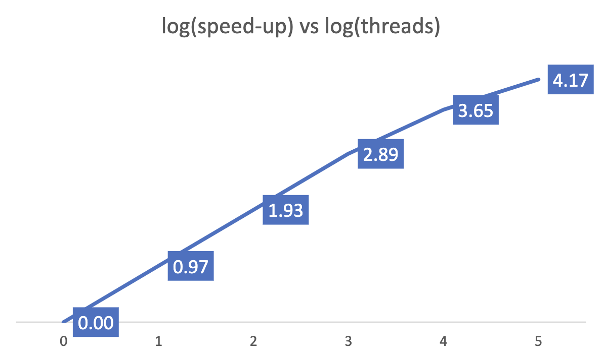

# N Body Interaction:

To initialize the system, I gave the points random velocities in different directions and most of the 
particles flew away from the origin. Some particles with low velocities were near the origin and 
formed swarms.  

### Serial:
The execution times for Serial codes for 20 iterations and 100,000 bodies was:  
Avg Time: 51.8s Total Time: 984.2s  
Grind Rate: 1/Avg Time = 0.019  

### Parallel:
Using openmp, we get the following times:  

|Threads|Total Time|Avg Time|Speed Up|Grind Rate |
|:----:|:---------:|:------:|:------:|:------:|
|1 | 982.620 | 51.717|  1.0 | 0.02 |
|2 | 502.622 | 26.454|  2.0 | 0.04 |
|4 | 257.735 | 13.565|  3.8 | 0.07 |
|8 | 132.222 | 6.959 | 7.4  |0.14 |
|16|  78.281 | 4.120 | 12.6 | 0.24 |
|32|  54.504 | 2.869 | 18.0 | 0.35 |

On increasing the threads, we get speed-
up up to a certain level. The total time taken for 1 thread is very similar to the total time taken for 
serial execution.

### CUDA: 
For GPU, we get the following performance: 

|Threads/Block | Total Time | Avg Time | Grind Rate |
|:----:|:---------:|:------:|:------:|
|1  |35.860 | 1.887  |0.53 |
|2  |18.020 | 0.948  |1.05 |
|4  |9.120  |0.480  |2.08 |
|8  |4.620  |0.243  |4.11 |
|16  |2.460 | 0.129  |7.72 |
|32  |1.290 | 0.068  |14.73 |
|64  |0.970 | 0.051  |19.59 |
|128 | 0.950|  0.050 | 20.00 |
|256 | 1.000|  0.053 | 19.00|

We get the best performance for 128 threads/block. The performance is way better than parallel code where the best total time was 
around 54s, which is around less than 1s here

Code for running the serial code - "makefile Serial"  
Code for running the serial code - "makefile Parallel"  

Following are the GIFs generated from different codes:  

### Serial:

### Parallel:

### CUDA:
